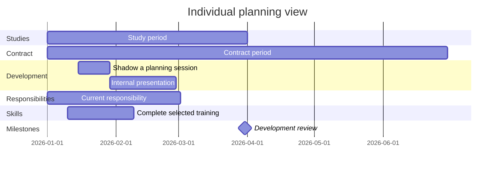

To facilitate planning and collaboration, we work with agenda repositories.
An agenda repository is a shared GitHub repository with a README.md file to keep track of meeting notes, TODOs, and items to discuss.
It serves as a single location to track information that can be linked and edited by all participants.

## Checklist for agendas

Use the following checklist to keep your agenda repository a practical, living resource for planning, coordination, and reflection.

::: {.callout-note title="Checklist"}

## 1. Make the agenda your own

- [ ] Keep in mind: the agenda will remain a private repository, shared between you and your supervisor.
- [ ] Treat the agenda as a shared but informal working document (no perfection needed).
- [ ] Adapt the structure to your personal workflow.
- [ ] Use it regularly as your primary planning resource.

---

## 2. Update the agenda regularly

- [ ] Define and revisit shared objectives and key results (OKRs) together.
- [ ] Proactively maintain development objectives, milestones, evidence, and upcoming activities.
- [ ] Include planned shadowing, internal presentations, publication contributions, and networking where relevant.
- [ ] Maintain a list of major ongoing projects.
- [ ] Keep a running “Items to Discuss” section.
- [ ] Maintain a weekly task list:
  - [ ] Check off completed items.
  - [ ] Copy unfinished items to the next week.
- [ ] Share a link to meeting notes before the meeting.
- [ ] Add meeting notes directly after each meeting.

---

## 3. Create a clear overview

- [ ] Keep orientation easy: structure before detail.
- [ ] Use folders and multiple documents where helpful.
- [ ] Add internal links between sections.
- [ ] Link to relevant external resources (repos, docs, papers, courses).
- [ ] Ensure the agenda can be understood quickly by all participants.

---

## 4. Maintain a timeline and planning view

- [ ] Create a Mermaid Gantt chart with sections for **Studies**, **Contract**, **Development**, **Responsibilities**, **Skills**, and **Milestones**.
- [ ] Give every Mermaid task a unique ID so dependencies remain unambiguous.
- [ ] Track contracts and important deadlines.
- [ ] Keep an overview of workload / hours.
- [ ] Plan development goals (topics, methods, skills).
- [ ] Map current and future projects over time.

---

## 5. Anticipate and track key periods

- [ ] Note upcoming vacations.
- [ ] Mark exam phases or teaching peaks.
- [ ] Maintain “waiting-for” items (e.g., reviews, decisions, responses).
- [ ] Maintain “upcoming” items (projects, papers, milestones).

---

## 6. Document interests and ideas

- [ ] Keep a section for research and teaching interests.
- [ ] Collect ideas for new projects.
- [ ] Use this as input for strategic discussions about next steps.

---

## 7. Document and celebrate success

- [ ] Record accepted/published papers.
- [ ] Add positive student feedback.
- [ ] Note milestones and accomplishments.
- [ ] Use this as a basis for CV building and reference letters.
- [ ] Regularly reflect on progress to stay motivated.

:::

## How We Use the Agenda in Meetings

### 1. Review Session (Looking Back)

At the beginning of each meeting, we:

- Review the weekly task list
- Check off completed items
- Reflect briefly on progress toward shared objectives
- Discuss blockers or “waiting-for” items
- Add short notes directly into the repository

The agenda is updated live during the meeting.

### 2. Planning Session (Looking Ahead)

In the second part of the meeting, we:

- Define or adjust objectives together
- Break down larger goals into concrete next steps
- Clarify responsibilities and expectations
- Identify priorities for the coming week
- Add new tasks directly to the weekly section

This ensures alignment and clear next actions.

### 3. Use of Issues and Links

To avoid duplication and keep information structured:

- Use GitHub issues for well-defined tasks and discussions
- Link concrete deliverables to GitHub issues instead of copying operational task lists into the agenda
- Link issues directly in the agenda
- Link to relevant repositories, documents, datasets, or papers
- Use the agenda as a coordination hub — not as a storage location

The agenda serves as a shared navigation layer across distributed work.

Personal employment and development details stay in the private agenda repository and must not be added to the public handbook.


## Template

Clone the [agenda template](https://github.com/fs-ise/agenda-template){target=_blank} repository.

```Markdown
# Agenda: Person A -- Person B

Regular meeting:

- Time: ...
- Location: ...

## Items to discuss

- Item

## Log

### CW 1

- Meeting note
```

Add a planning view using the recommended sections. Dates below are placeholders; every task ID is unique.



Replace the examples with links to objectives or GitHub issues; do not duplicate issue task lists in the chart.

## Resources

- [Agenda: Example GitLab/Rayana](https://gitlab.com/rayana/plan/){target=_blank}
