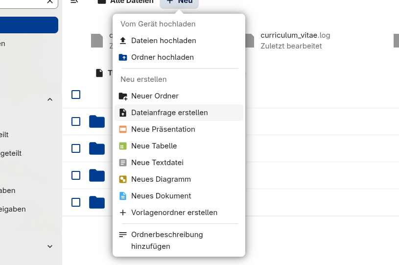

::: {.callout-note title="TODO"}
TODO: regularly export tree -d -L 3
:::

Contains all **confidential** materials for lab management, teaching, research, funding, and service.
Also our preferred choice for binary/large files and archived data.

## Web interface

[ Nextcloud](https://nc-2272638881871040784.nextcloud-ionos.com/){.btn .btn-primary .btn-center rel="noopener" target=_blank}


## Local Nextcloud client

See [overview of clients](https://nextcloud.com/de/install/#install-clients){target=_blank} (use *Nextcloud Files*).

To configure: 

- Click "Anmelden"
- Enter the following URL:

```sh
https://nc-2272638881871040784.nextcloud-ionos.com/
```
- Give access in Browser (pop-up)
- Accept default settings.

## Archive (digitalized documents)

::: resource
[Archive]().
:::

## File requests

Use **Dateianfrage erstellen** when external collaborators should upload files to us without receiving access to the full folder contents.

Recommended use cases:

- collecting signed forms, screenshots, PDFs, or other files from external collaborators;
- receiving large files that should not be sent by email;
- collecting files from people who do not have a Nextcloud account.

Steps:

1. Open the relevant destination folder in Nextcloud.
2. Click **+ Neu**.
3. Select **Dateianfrage erstellen**.
4. Give the request a clear name, for example `Upload signed forms`.
5. Copy the generated link and send it to the uploader.
6. After receiving the files, move them into the appropriate project or archive folder and delete or close the request if it is no longer needed.

Uploaders can submit files through the link without logging in. They should not be able to browse the existing folder contents. This is preferable to email attachments for confidential or large files.



## Extensions

**Collaborative editing of a shared document (without login)**: create md-file and public link (can edit).
