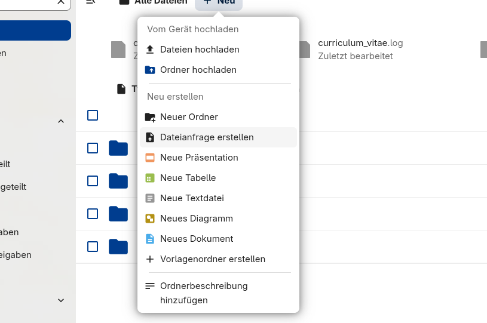

Contains all **confidential** materials for lab management, teaching, research, funding, and service.
Also our preferred choice for binary/large files and archived data.

## Overview

| Path                       | Access | Contents                                                                             |
| -------------------------- | -----: | ------------------------------------------------------------------------------------ |
| `teaching/materials`       |     🏢 | Course materials, slides, exercises, templates, and teaching resources               |
| `teaching/orga`            |     🏢 | Course planning, schedules, coordination documents, and administrative materials     |
| `teaching/publications`    |     🏢 | Publications and manuscripts related to teaching and education                       |
| `teaching/recommendations` |     👤 | Recommendation letters, supporting documents, and related templates                  |
| `teaching/theses`          |     👤 | Thesis supervision documents, student submissions, assessments, and correspondence   |
| `research/literature`      |     🏢 | Literature collections, PDFs, search results, and review materials                   |
| `research/processes`       |     🏢 | Research procedures, templates, methodological guidance, and shared workflows        |
| `research/projects`        |     👤 | Project-specific documents, data, analyses, manuscripts, and collaboration materials |
| `research/publications`    |     🏢 | Submitted, accepted, and published research outputs and related files                |
| `research/research-hub`    |     🏢 | Shared research resources, coordination materials, and cross-project information     |
| `management/archive`       |     🔒 | Archived administrative documents and completed records                              |
| `management/compliance`    |     🔒 | Compliance documentation, policies, approvals, and audit-related records             |
| `management/controlling`   |     🔒 | Budgets, financial monitoring, reports, and planning documents                       |
| `management/grades`        |     🔒 | Student grades, examination records, and assessment documentation                    |
| `management/hr`            |     🔒 | Personnel records, contracts, applications, and staff-related documents              |
| `management/mail`          |     🔒 | Relevant administrative correspondence and exported email records                    |
| `management/travel`        |     🔒 | Travel requests, bookings, reimbursements, and supporting documents                  |

**Access:** 🏢 Internal team · 👤 Individual / project-specific · 🔒 Restricted

::: {.callout-note title="Check" collapse=true}

```sh
tree -d -L 4 ~/Nextcloud/{teaching,research,management} \
  > nextcloud-directory-tree.txt
```

Prompt (attach directory tree):

```Markdown
Compare the following Nextcloud directory tree with the documented target structure:

INSERT_TARGET_STRUCTURE

Assess compliance at the first two directory levels.

Identify:

* required paths that are present;
* required paths that are missing;
* unexpected top-level or second-level directories;
* naming deviations, including capitalization, spelling, pluralization, spaces, underscores, and hyphens;
* directories that appear misplaced based on their names;
* possible duplicates or overlapping categories;
* structures that may conflict with the documented access model;
* directories whose purpose cannot be determined from their name.

Do not treat deeper project-, course-, thesis-, or person-specific subdirectories as non-compliant merely because they are not listed in the target structure.

Return:

1. A concise overall compliance assessment.
2. A Markdown table with the columns:

| Path | Status | Finding | Recommended action |
| ---- | ------ | ------- | ------------------ |

Use these status values:

* ✅ Compliant
* ⚠️ Review
* ❌ Missing
* ➕ Undocumented

3. A revised target table if the actual structure suggests justified changes.
4. A short list of concrete rename, move, create, or remove actions.

Do not infer actual Nextcloud permissions from folder names alone. Flag potential access concerns separately and state that permissions must be verified in Nextcloud.


```

:::

## Web interface

[ Nextcloud](https://nc-2272638881871040784.nextcloud-ionos.com/){.btn .btn-primary .btn-center rel="noopener" target=_blank}


## Local Nextcloud client

See [overview of clients](https://nextcloud.com/de/install/#install-clients){target=_blank} (use *Nextcloud Files*).

To configure: 

- Click "Anmelden"
- Enter the following URL:

```sh
https://nc-2272638881871040784.nextcloud-ionos.com/
```
- Give access in Browser (pop-up)
- Accept default settings.


## File requests

Use **Dateianfrage erstellen** when external collaborators should upload files to us without receiving access to the full folder contents.

Recommended use cases:

- collecting signed forms, screenshots, PDFs, or other files from external collaborators;
- receiving large files that should not be sent by email;
- collecting files from people who do not have a Nextcloud account.

Steps:

1. Open the relevant destination folder in Nextcloud.
2. Click **+ Neu**.
3. Select **Dateianfrage erstellen**.
4. Give the request a clear name, for example `Upload signed forms`.
5. Copy the generated link and send it to the uploader.
6. After receiving the files, move them into the appropriate project or archive folder and delete or close the request if it is no longer needed.

Uploaders can submit files through the link without logging in. They should not be able to browse the existing folder contents. This is preferable to email attachments for confidential or large files.



## Extensions

**Collaborative editing of a shared document (without login)**: create md-file and public link (can edit).
